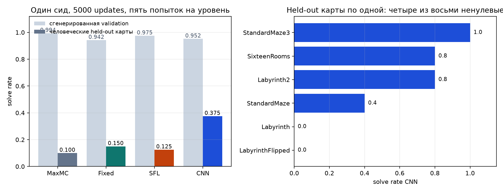

# Курикулум со стороны учителя для переноса в незнакомые лабиринты

Чекпойнты выбранного метода и собственного прогона ACCEL лежат в `checkpoints/submission/`, вся диагностика — в [DIAGNOSTICS.html](DIAGNOSTICS.html).

Я менял только то, как учитель выбирает уровни. Архитектура студента, алгоритм PPO и бюджет обучения остались исходными, иначе сравнение с бейзлайнами потеряло бы смысл.

ACCEL отбирает уровни по приближению регрета. Я проверил, можно ли находить границу способностей студента точнее, если предсказывать вероятность успеха напрямую по карте.

Выбранным методом стал свёрточный предиктор обучаемости. На человеческих отложенных картах он опережает ближайший вариант в два с половиной раза, хотя на сгенерированной валидации не лучший. Помог он на комнатах и обычных лабиринтах, а карты с длинными коридорами остались нерешёнными у всех четырёх методов.

Из мощностей у меня был MacBook Pro на M1 Max, и здесь предварительные прогоны шли целиком на процессоре: JAX на Apple Silicon не даёт рабочего ускорителя, так что даже замороженный ResNet-18 в одном из вариантов считался на CPU. Этого хватало, чтобы проверить код, кластеризацию неудач и визуализации, но не чтобы сравнивать методы.

Доступ к видеокартам был только по университетским очередям, и я им воспользовался. Темы задания для меня новые, я долго разбирался в каждой из них, и на прогоны оставалось столько времени, сколько оставалось. Поэтому итоговый отсев сделан на одном сиде и 5000 обновлений вместо тридцати тысяч, которые просит задание. Я знаю, зачем нужны несколько сидов и полный бюджет, но с оставшимся временем сосредоточился на том, что показывает перенос на отложенные карты.

Мой бэкграунд — представления данных, в большей степени мультимодальные, и в обучении с подкреплением я относительно неопытен: это задание было для меня самым новым по инженерной части. Исходя из этого я старался не ограничиваться стандартными прогонами, а придумать что-то своё.

Студента, генератор уровней и мутации я сознательно не трогал: весь эксперимент про то, как учитель считает скор уровня. Итоговый отсев сравнил четыре варианта учителя на одном сиде, пяти тысячах обновлений и пяти попытках на уровень, при одинаковом студенте, генераторе, мутациях и бюджете.

Два обстоятельства мешают читать таблицу времени напрямую. Число взаимодействий и время работы здесь расходятся: дополнительные поисковые прогоны SFL почти ничего не стоят, потому что сто двадцать восемь уровней по пять попыток считаются одним векторизованным батчем. А вариант с фиксированными признаками медленнее свёрточного по чисто технической причине: он каждое обновление выгружает карты из JAX в NumPy и считает признаки обычным циклом, тогда как свёртка целиком остаётся в скомпилированном коде на видеокарте.

## 1. Задача

Студент обучается на автоматически созданных лабиринтах, а после обучения решает восемь отложенных уровней, которых учитель никогда не видел. Нужно обойти PLR и ACCEL при одинаковом числе обучающих взаимодействий, причём отложенные уровни нельзя использовать ни для обучения, ни для подбора гиперпараметров.

Основной вопрос работы в том, какой скор уровня отличает уровень на границе способностей от слишком лёгкого, слишком трудного или просто шумного.

## 2. Почему я проверял другой скор

PLR и ACCEL используют приближения регрета, а MaxMC зависит от ретурна и value-функции и напрямую вероятность освоить уровень не оценивает.

Полезным я считал уровень, который текущий студент иногда решает, а иногда нет. Для вероятности успеха $q$ обучаемость равна $q(1-q)$ и максимальна около $q=0.5$.

Задача мне понравилась, и ограничение в ней хорошее. После собственного разбора стало понятно, что все версии регрета — это прокси-метрики, которые алгоритмы обучения с подкреплением очень легко эксплуатируют. Так устроено большинство метрик, которые оценивают полезность косвенно.

Единственной честной метрикой здесь оказалась обучаемость: если посмотреть статистически, какие уровни агент решает, а какие нет, при похожей структуре карты. Стоит напомнить себе, что по сути мы просто смотрим, где агент ошибается, — какие бы математические конструкции мы вокруг этого ни строили и на какие бы головы модели ни опирались. Value-функции тоже ошибаются и имеют большое смещение. Причём можно пойти дальше и спросить не «сложный ли уровень», а «что конкретно в нём сложное».

Этот вопрос и привёл меня к кластеризации неудач на предварительном прогоне, который я сделал на ноутбуке на небольшом числе итераций. Я просто хотел посмотреть, срывается ли агент на определённых частях лабиринта или на определённых типах карт.

После ручной проверки оказалось, что он срывается на прямых длинных коридорах: он не умеет просто идти вперёд, он умеет обходить. Разделение по признакам было видно буквально глазами.

Отсюда родилась первая, наивная идея: составить фиксированный набор признаков карты, по которому оценивается её сложность.

Идея рабочая, но привязана к лабиринтам. Я стал думать, как обобщить её на любые среды, и придумал иерархическую диагностику: если поставить агенту голову предсказания следующего кадра, как в TRACED, то по ошибке этого предсказания можно находить типичные неудачи в любой среде.

До конца эта ветка не дошла. Ключевой вопрос в ней — сколько кадров брать в окно, чтобы поймать зависимость «было до, стало после, какие условия, какое неверное действие», и сопоставление окон разной длины между собой оказалось нетривиальным. Осталась базовая диагностика.

Зато нашёлся вариант посередине: посмотреть на лабиринт сверху, как это делает человек, и выучить его признаки заранее, просто глядя на карту. Через такое представление, свёрточный кодировщик карты, который обновляется вместе со студентом, можно предсказывать сложность — и не только лабиринта, а любой двумерной статической среды. Так я и сделал, использовав кодировщик как замену дорогим выборкам обучаемости.

На валидационных результатах он показал себя хорошо, хотя динамика обучения у него хуже остальных. Метод при этом получился простой и понятный. Фиксированные признаки упёрлись в свой предел, который не смогли преодолеть, — вероятно, потому что они статичны. А чистый SFL, который по идее должен был обойти все бейзлайны, на части задач оказался не настолько эффективным.

## 3. Что я проверял

### 3.1 ACCEL с MaxMC

Основной контроль. Генератор, буфер, реплей и мутации взяты из ACCEL без изменений.

### 3.2 Предиктор по фиксированным признакам

Прямое продолжение наблюдения про длинные коридоры: если сложность видна глазами, попробуем описать её числами. Учитель получает семь величин — длину кратчайшего пути, расстояние по прямой, извилистость, число тупиков, число развилок, плотность стен и длину самого длинного коридора. Небольшая сеть предсказывает по ним вероятность успеха текущего студента, а скор считается как $q(1-q)$. Вариант проверяет, достаточно ли нескольких понятных свойств карты.

### 3.3 Свёрточный предиктор

Следующий шаг: убрать ручной отбор признаков и дать сети саму карту. Она получает стены, старт и цель, предсказывает ту же вероятность и использует тот же скор. Вариант проверяет, теряют ли семь чисел важную геометрию.

### 3.4 Предобученный ResNet-18

Раз речь про изображение карты, стоило проверить и готовое визуальное представление. Замороженный ResNet-18 кодирует карту, обучается только голова вероятности. Заранее я на него не рассчитывал: в ImageNet нет ничего похожего на нашу геометрию.

### 3.5 SFL

Прямая проверка обучаемости без обучаемого предиктора вообще: несколько эпизодов на каждом случайном уровне, отбор уровней с высокой $p(1-p)$, смешивание буфера с новыми случайными картами. Поисковые прогоны здесь считаются отдельно от обучающих.

### 3.6 Выбранный метод

Я выбрал свёрточный предиктор обучаемости.

Свёрточная сеть получает карту целиком, тремя каналами: стены, положение старта и положение цели. На выходе одна вероятность успеха $q$, обученная бинарной кросс-энтропией по фактическим исходам роллаутов текущего студента. Скор уровня равен $q(1-q)$ и попадает в буфер там же, где ACCEL кладёт свой, поэтому буфер, вероятность реплея и мутации остались от ACCEL без изменений. Предиктор обновляется на тех же роллаутах, которыми обучается студент, отдельных эпизодов на оценку он не тратит. Студент, генератор уровней и мутации не менялись вообще: иначе сравнение с бейзлайнами потеряло бы смысл.

Выбрал я его по результату на отложенных человеческих картах, а не по интуиции: он даёт 0.375 против 0.150 у фиксированных признаков и 0.125 у SFL, при том что на сгенерированной валидации он не лучший. Поуровневый разбор и кластеризация неудач — в [DIAGNOSTICS.html](DIAGNOSTICS.html).

## 4. Экспериментальный протокол

- Кодовая база JaxUED, коммит `0f8f1284677375b889e4f13a32c9617cd009f8c4`.
- Среда: Maze 13x13, обзор 5x5, 25 стен.
- Студент: исходный PPO с LSTM из JaxUED.
- Бюджет обучения: 5000 обновлений, 40.96 млн обучающих взаимодействий на метод.
- Методы: ACCEL с MaxMC, фиксированные признаки, свёрточный предиктор и SFL.
- Сид один, нулевой.
- Валидация: 64 уровня исходного генератора на сиде 10000, в обучении не участвуют.
- Отложенный набор: восемь человеческих карт из задания, только для итоговой оценки.
- Оценка: пять попыток на уровень, последний чекпойнт прогона, одинаковый порядок случайных чисел у всех методов.
- Железо: одна A100 на метод, от 1076 до 1871 секунды на прогон.

## 5. Предварительный отсев

Короткие прогоны на ноутбуке проверяли код и раннюю динамику; итоговый порядок методов они не определяют.

Три варианта я отбросил по механизму, а не по числу. Наивная обучаемость по одному прогону даёт только ноль или единицу, поэтому её произведение всегда нулевое, и вместо неё я реализовал уменьшенный, но механически правильный SFL с отдельным поиском и фронтир-буфером. Оценка по ошибке предсказания следующего кадра и её вариант с совместной обучаемостью остались диагностикой и в отбор уровней не входят. Предобученный ResNet в финал не пошёл: обучение на естественных изображениях не даёт полезного априорного знания для двоичной карты стен.

В итоговое сравнение попали четыре варианта учителя: MaxMC как контроль, фиксированные признаки, свёрточный предиктор и SFL.

## 6. Итоговые результаты

| метод | доля решённых на валидации | на отложенных картах | обучающих взаимодействий | поисковых | время |
|---|---:|---:|---:|---:|---:|
| MaxMC | 0.994 | 0.100 | 40.96 млн | 0 | 1871 с |
| фиксированные признаки | 0.942 | 0.150 | 40.96 млн | 0 | 1281 с |
| SFL | 0.975 | 0.125 | 40.96 млн | 16.0 млн | 1076 с |
| свёрточный предиктор | 0.952 | 0.375 | 40.96 млн | 0 | 1248 с |

Порядок методов на двух наборах получился разный. На сгенерированной валидации свёрточный предиктор не лучший, там впереди SFL и MaxMC, зато на человеческих отложенных картах он опережает ближайший вариант в два с половиной раза.

Правый график показывает, откуда взялся этот перевес. Ненулевой результат он получил на четырёх картах из восьми, а Labyrinth и LabyrinthFlipped остались на нуле — как раз те карты с длинными коридорами, из-за которых всё и затевалось. Всю геометрию лабиринтов он представлять не научился, он нашёл курикулум, который перенёсся на часть новых карт.

Время работы здесь читается не напрямую. Обычный сбор роллаутов занял у всех методов примерно одинаково, а дополнительные поисковые прогоны SFL почти ничего не стоили. MaxMC медленнее всех потому, что рядом с ним обучался диагностический предиктор переходов.

## 7. Почему учитель ведёт себя так

SFL вообще не смотрит на устройство карты. Раз в пятьдесят обновлений он генерирует сто двадцать восемь случайных карт, прогоняет студента по пять раз на каждой, считает долю успехов и оставляет шестьдесят четыре лучших уровня, а дальше собирает обучающие батчи наполовину из этого буфера, наполовину из новых случайных карт. Пять попыток дают всего шесть возможных значений доли, и главное — он не переносит знание между похожими картами: каждую новую карту студент должен проверить отдельно.

Свёрточный предиктор устроен иначе. Он получает карту целиком, со стенами, стартом и целью, и предсказывает вероятность успеха. Скор у него тот же, но вероятность берётся из изображения, без дополнительных попыток, а буфер, реплей и мутации остались от ACCEL. Обучается он с нуля, без предобучения: его единственное априорное знание — сама структура свёрток, где соседние клетки обрабатываются вместе, а одинаковые локальные конфигурации распознаются одними весами.

Отсюда и объяснение, почему свёрточный предиктор способен обойти SFL. Уменьшенный SFL ищет границу способностей только среди ста двадцати восьми случайных карт и оценивает долю успехов по пяти шумным попыткам, тогда как предиктор переносит опыт прошлых прогонов на новые, пространственно похожие карты, и работает внутри ACCEL с его реплеем и мутациями. Фиксированные признаки сжимают карту в семь чисел, поэтому разные лабиринты могут выглядеть для них одинаково.

## 8. Поведенческая диагностика

Рядом с ACCEL я отдельно обучал предиктор следующего наблюдения по текущему кадру и действию. На выбор уровней и на самого студента он не влияет и нужен только для того, чтобы увидеть, где именно агент ошибается.

Диагностика показала ровно ту неудачу, с которой всё началось: агент не проходит прямые длинные коридоры. Этого достаточно, чтобы объяснить нулевой результат на двух отложенных картах у всех четырёх методов. Но это не доказывает, что предиктор отбирает уровни именно по длине коридора: связь между предсказанной сложностью и конкретным признаком карты я не измерял.

## 9. Ограничения и отрицательные результаты

Скажу прямо: нескольких сидов и остальных бейзлайнов у меня нет, я просто не успел их прогнать. Задание просит сравнения с DR, PLR и ACCEL на тридцати тысячах обновлений и нескольких сидах, а у меня один сид и пять тысяч обновлений. Поэтому свёрточный предиктор — кандидат, а не доказанный метод.

Остаётся и незакрытый разрыв с бейзлайном: мой полный прогон ACCEL дал заметно меньше, чем сообщает статья. Пока он не закрыт, ранние структурные выводы нельзя принимать за объяснение метода.

На сгенерированной валидации свёрточный предиктор не превосходит SFL: тот быстрее осваивает обычное распределение генератора. Весь перевес держится на человеческих отложенных картах, то есть это результат переноса, а не общего качества.

Проблему длинных коридоров, из-за которой всё затевалось, он тоже не решил: две карты с такими коридорами остались на нуле у всех методов.

Самое правдоподобное объяснение в том, что полная карта позволила учителю выбирать более переносимые мутации, чем семь агрегированных признаков или небольшой случайный поиск. Чтобы это доказать, нужно на одном наборе обучающих карт сравнить фактическую долю успехов, предсказания обоих предикторов, порядок карт по каждому скору и последующее улучшение студента. Такого сравнения у меня нет, поэтому пока это интерпретация.

По дороге я получил три отрицательных результата, и каждый поменял решение. Наивная обучаемость по одному прогону оказалась некорректной, потому что двоичный исход даёт нулевое произведение. Поиск редких состояний я отбросил: редкость ситуации не означает, что на ней есть чему учиться. Предиктор следующего кадра остался диагностикой и в отбор уровней не вошёл.

Временная диагностика тоже вышла не такой, как я задумывал. Сейчас для каждого размера окна строится своя кластеризация, и длинное окно никак не связано с короткими, которые внутри него лежат. Получилось несколько независимых деревьев вместо одной вложенной иерархии, и деревья не разрезаны, поэтому готовых типов неудач там пока нет.

Чекпойнты выбранного метода и собственного прогона ACCEL лежат в `checkpoints/submission/` в родном формате JaxUED, архитектура политики не менялась.
